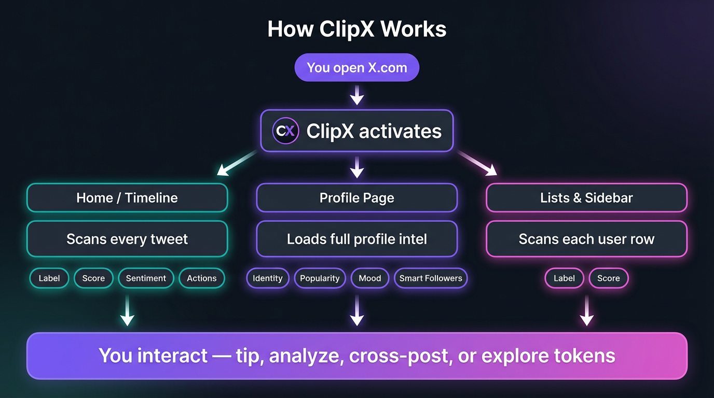
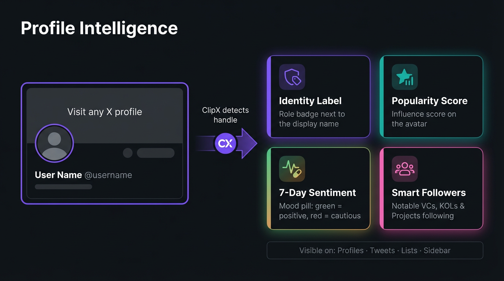
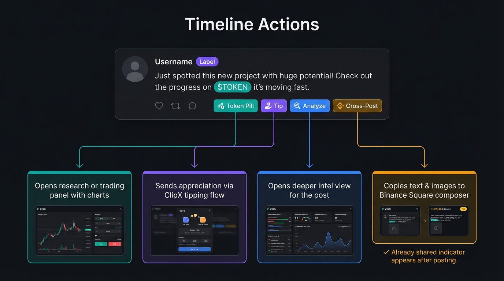
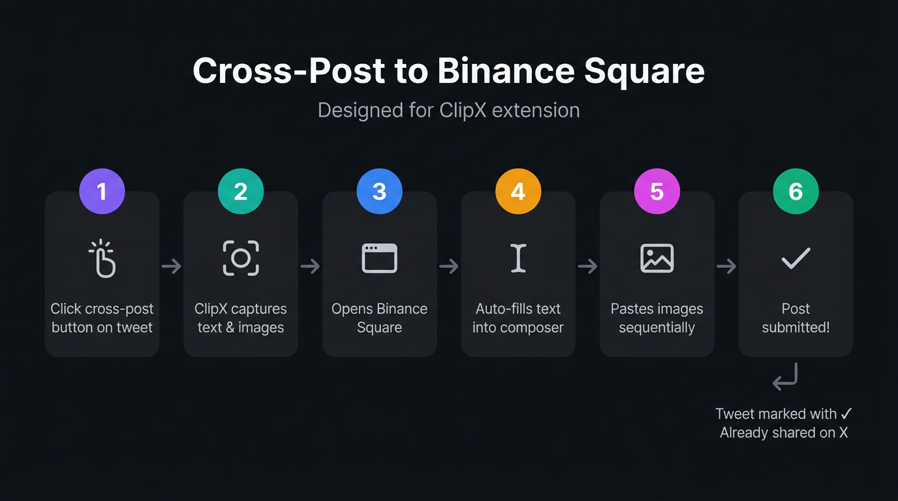

# ClipX — Track & Trade on X

ClipX is a browser extension for **X (Twitter)**. It adds **profile intelligence** on top of your normal feed: labels, influence-style scores, short-term sentiment, notable followers, and **timeline tools** for tokens, tips, and sharing.

Sign in with ClipX when prompted so labels, scores, and account features can load.

---

## How ClipX works — overview

The moment you open X.com, ClipX activates and enriches three surfaces: your timeline, any profile you visit, and list / sidebar views. Here is the full picture:

- **Home / Timeline** — Every tweet is scanned and enhanced with labels, scores, sentiment indicators, and action buttons.
- **Profile Page** — Full intel loads: identity label, popularity score, 7-day mood, and Smart Followers.
- **Lists & Sidebar** — Each user row gets an identity label and score so you can scan quickly.

All of this feeds into the actions you can take without leaving X.

---

## Profile intelligence

When you visit any profile, ClipX detects the handle and loads four layers of context automatically:

### Identity Label

A small **badge next to the display name** that tells you how ClipX categorizes the account — for example creator, project, fund, or another role.

- Appears on **profiles, tweets, follower lists, "Who to follow"**, and **sidebar suggestions**.
- Uses **color cues** (warm, cool, or alert tones) for quick visual scanning.
- If ClipX has no label for the account, nothing is shown — no guessing.

### Popularity Score

A **single influence-style score** near the **profile photo** (pill under or around the avatar). Think of it as social proof, not a trading signal.

- Also visible as a **light ring or pill on avatars** in the timeline and feeds.
- Updates when you open profiles or as the feed refreshes.
- Can be turned off in settings.

### 7-Day Sentiment

A **mood pill** near the name row that summarizes how conversation around the handle has felt over the **last seven days**.

- **Green** tones = generally positive recent sentiment.
- **Amber / red** tones = conversation has been rougher or cautious.
- Also shows on the **timeline** and in **list views** beside handles.
- This is summarized and delayed — use it as one input alongside your own reading.

### Smart Followers

A view of **who follows this account that matters** — not a raw count, but notable names grouped by type.

- **Category chips**: VCs, KOLs, Projects — with counts.
- **Expandable / collapsible** list of clickable avatar pills.
- **Filter** by category to focus on one type of follower.
- Data comes from ClipX's ranked follower service, not your private X data.

---

## Timeline trading & action layer

ClipX adds four actions directly on every tweet so you can act without leaving the feed:

| Action | What it does |
|--------|-------------|
| **Token Pill** | Highlights tickers and token names in tweet text. Click a pill to open a research or trading panel with charts. |
| **Tip** | Opens the ClipX tipping flow to send appreciation to the tweet author. Can be toggled off in settings. |
| **Analyze** | Opens a deeper intel view for the post or link — what loads depends on your ClipX setup. |
| **Cross-Post** | Copies the tweet's text and images into a Binance Square post (see detailed flow below). |

You can also enable an **optional market insight widget** on the home timeline for a compact view of trending data.

---

## Cross-post to Binance Square — step by step

One click on a tweet starts a fully assisted posting flow:

1. **Click** the cross-post button on any tweet.
2. **ClipX captures** the tweet text and all images.
3. **Binance Square opens** in a new tab.
4. **Text auto-fills** into the composer.
5. **Images paste** one by one (multi-image supported).
6. **Post is submitted** to Binance Square.

Back on X, the tweet is marked with a **green checkmark** ("Already shared to Binance Square") so you do not duplicate by accident. You can still re-post intentionally.

---

## How to use ClipX day to day

1. Install ClipX from your browser's store (or follow the steps that came with a test build).
2. Open **X** and browse normally. Profile labels, scores, sentiment, and Smart Followers load when you visit profiles or scroll feeds.
3. Open the **ClipX icon** (or side panel) to **sign in**, check your ClipX balance if shown, and **toggle** features like tips, sentiment, scores, or the home widget.
4. On tweets, use **tip**, **analyze**, **token pills**, or **cross-post** actions when you need them.

---

## Who it is for

Traders, researchers, and creators who live on **crypto Twitter** and want **identity, influence, sentiment, and follower quality** next to every name — plus **faster actions** on the timeline.

---

## Updates

New builds may tune labels, scoring, or layout. If something looks missing after an X redesign, update ClipX to the latest version your team published.
